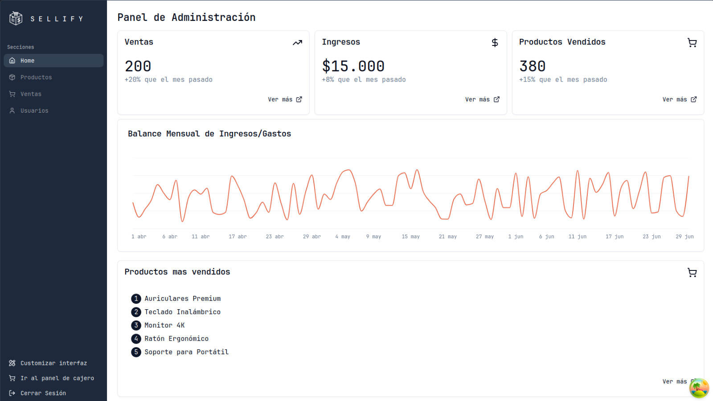

# Sellify

Sellify es un sistema privado de ventas diseñado para pequeñas y medianas empresas, específicamente para aquellos que necesitan gestionar sus productos y ventas de manera eficiente. Nuestro sistema se compone de dos partes fundamentales. La primera es el panel de administración, que es donde el jefe o el dueño va a gestionar su negocio. La segunda es la parte del cajero, diseñada específicamente para las operaciones diarias en el punto de venta. En este panel se ingresaran los productos, se procesaran las ventas y posteriormente se emitirán las boletas.

Este proyecto fue realizado durante el cuarto semestre de Ingeniería Civil en Informática de la Universidad Catolica de Temuco para la asignatura "Taller de Integración II".

## Tech Stack

**Client:** React, TypeScript + Vite
, TailwindCSS

**Server:** Flask, MariaDB

# Guia de desarrollo

## Requisitos

- Node.js 20.11 (LTS).

## Instalación

```bash
npm install -g pnpm
cd <carpeta-de-proyecto>
# Instalar dependencias
pnpm i
```

<!-- ## Desarrollo

```bash
pnpm dev
```

## Flujo de trabajo en git

Crear rama

```bash
git checkout -b <nombre-tarea>
```

Agregar cambios

```bash
git add .
```

Commit (ideal)

```bash
git commit -m "<tipo-de-commit>[scope]: <descripcion>"
```

Volver a develop

```bash
git checkout develop
git merge <nombre-tarea>
git push origin develop
``` -->

## Desarrolladores

- [@vcntttt](https://github.com/vcntttt) - Scrum Master
- [@TsuKenzo](https://github.com/TsuKenZo)
- [@MrGhost](https://github.com/NelsonNeculhueque)
- [@patitojavi](https://github.com/patitojavi)
